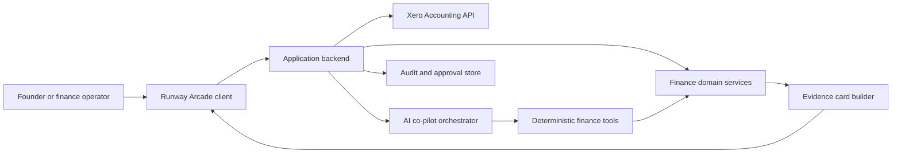
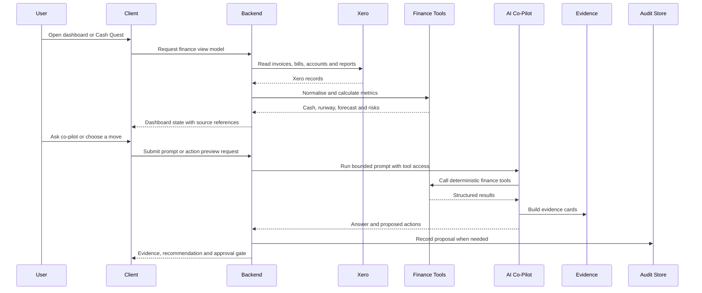

# System Architecture: Runway Arcade

## Overview

Runway Arcade is a Xero-centred cashflow decision tool for small businesses. It presents invoices, bills, cash position, runway and payment pressure through a dashboard, an AI co-pilot and a gamified Cash Quest interface.

The current repository contains static Lovable preview mirrors plus documentation and submission material. The production architecture described here is the recommended source-level shape for rebuilding the project with live Xero data, server-side AI orchestration and reliable approval controls.

## Key Requirements

- Make Xero central to the workflow, not a decorative add-on.
- Analyse cash position, bills, invoices, contacts, payments and reports through a stable finance data adapter.
- Use deterministic finance calculations for dashboard metrics and co-pilot evidence.
- Keep AI recommendations evidence-backed and bounded by approved tools.
- Distinguish demo fallback, simulation and live Xero state clearly.
- Require explicit user confirmation before payments, customer chases, supplier contact, Xero writes or external actions.
- Maintain an audit trail for proposed actions, approvals and future write attempts.
- Keep OAuth tokens and financial secrets server-side only.

## High-Level Architecture

The client owns the interactive dashboard, Cash Quest map and approval UI. The backend owns trust-sensitive work: Xero OAuth, token storage, data normalisation, finance tools, AI prompt assembly, approval policy and audit persistence.

## Component Details

### Client Application

- Responsibilities: render the dashboard, Cash Quest, co-pilot panel, MAYDAY plans, evidence cards and approval controls.
- Main technologies: React and TypeScript are recommended for the rebuilt source app. The current checked-in preview is a static Lovable bundle.
- Data owned or transformed: view state, selected scenario, local interaction state and display-only evidence.
- External dependencies: backend API, static assets and the Lovable-hosted demo during the hackathon.
- Failure modes: stale demo bundle, partial data, unclear live-versus-demo state or inaccessible controls.

### Backend API

- Responsibilities: expose dashboard data, co-pilot responses, finance tool execution, approval actions and audit exports.
- Main technologies: server-side TypeScript or another production web backend.
- Data owned or transformed: normalised finance records, organisation context, proposed actions and audit events.
- External dependencies: Xero API, AI provider, database and hosting platform.
- Failure modes: Xero token expiry, provider outage, partial API responses, rate limits or inconsistent calculation logic.

### Xero Adapter

- Responsibilities: read Xero organisation data through a stable internal interface.
- Main technologies: Xero OAuth 2.0 and Xero Accounting API.
- Data owned or transformed: invoices, bills, contacts, payments, bank accounts, reports, aged receivables and aged payables.
- External dependencies: Xero tenant connection, OAuth scopes and Xero API availability.
- Failure modes: missing scopes, disconnected tenant, expired refresh token, changed endpoint behaviour or incomplete accounting data.

### Finance Domain Services

- Responsibilities: calculate cash position, runway, burn rate, seven-day forecast, overdue invoices, due bills and route impacts.
- Main technologies: deterministic application code with unit tests.
- Data owned or transformed: normalised finance records and derived metrics.
- External dependencies: none beyond the adapter data contract.
- Failure modes: formula drift, timezone mistakes, missing source records or different calculations between dashboard and co-pilot.

### AI Co-Pilot Orchestrator

- Responsibilities: assemble prompts, call approved tools, render structured answers and preserve safety rules.
- Main technologies: AI SDK or equivalent server-side orchestration layer.
- Data owned or transformed: user questions, tool calls, evidence summaries and proposed actions.
- External dependencies: AI model provider and finance tool registry.
- Failure modes: unsupported claims, hallucinated numbers, prompt injection or model output that implies an action happened when it did not.

### Approval and Audit Service

- Responsibilities: store proposed actions, approval decisions, simulated outcomes and future write attempts.
- Main technologies: database-backed append-only event model.
- Data owned or transformed: action status, approver, timestamp, source records, before-and-after state and external write result where applicable.
- External dependencies: database and authentication provider.
- Failure modes: missing audit events, replayed approvals, unclear simulation state or untraceable external actions.

## Data Flow

The main rule is that every money-bearing user response should be traceable to a tool result and a source record. Proposed actions are not treated as completed actions until the approval service records the required confirmation and, in a future write-capable release, the external write result.

## Data Model

Core production entities:

| Entity | Purpose |
| --- | --- |
| Organisation | Connected Xero tenant and display metadata. |
| CashAccount | Bank or reserve account balance used for cash position. |
| Invoice | Customer invoice, due date, amount due, expected recovery and source reference. |
| Bill | Supplier bill, due date, amount due, criticality and source reference. |
| Contact | Customer or supplier relationship metadata. |
| Payment | Historical or scheduled payment context. |
| Forecast | Derived cash-in, cash-out and runway impact over a time window. |
| ProposedAction | Chase, delay, pay, protect or MAYDAY action awaiting approval. |
| AuditEvent | Immutable record of proposal, simulation, approval or write attempt. |
| EvidenceCard | User-facing explanation tied to tool calls and source records. |

Money values should use integer minor units internally and formatted strings only at the display boundary.

## Infrastructure and Deployment

Current repository state:

- `runway-arcade-local/` is a static mirror of a Lovable deployed preview.
- `blockhaven-local/` is a static reference mirror used for the isometric game style.
- `docs/` contains product, technical, API, calculation, QA and security documentation.
- `materials/` contains pitch, submission, handover and judge-demo material.

Recommended production deployment:

- Frontend hosted as a web application.
- Backend deployed separately or as server routes with server-only secrets.
- Database for tenants, approvals, audit logs and token metadata.
- Xero OAuth redirect URL registered in the Xero developer portal.
- AI provider key stored server-side.

## Scalability and Reliability

- Cache short-lived read data to reduce Xero API pressure.
- Show last sync time and stale-data states.
- Keep calculations deterministic and covered by tests.
- Handle partial Xero data by rendering incomplete-state warnings rather than hiding risk.
- Queue or retry non-urgent sync work if Xero or the AI provider is temporarily unavailable.
- Keep write-capable actions disabled until idempotency, retry and audit behaviour are defined.

## Security and Compliance

- Store Xero access and refresh tokens server-side only.
- Encrypt tokens at rest.
- Use least-privilege OAuth scopes.
- Keep read scopes separate from any future write scopes.
- Do not send unrestricted raw Xero payloads to the AI model.
- Redact or minimise customer and supplier data in logs.
- Require explicit approval before any external action.
- Record audit events before and after future write attempts.
- Treat the co-pilot as decision support, not regulated financial advice.

Current limitation: the static mirror is not a production security boundary and should not be used to handle real secrets.

## Observability

Minimum production events:

- Tenant connected or disconnected.
- Xero data sync started, completed or failed.
- Finance tool call started, completed or failed.
- Co-pilot response generated with referenced tool calls.
- Proposed action created.
- Simulation approved.
- Future write action confirmed, attempted, succeeded or failed.
- Audit export created.

Logs should include request IDs and source references but avoid unnecessary personal or commercially sensitive data.

## Design Decisions and Trade-offs

- Static mirror first: useful for hackathon review and demos, but not suitable for long-term development.
- Adapter boundary for Xero: adds structure now and makes demo fixtures replaceable with live Xero reads later.
- Deterministic tools before AI prose: reduces hallucination risk and keeps financial numbers explainable.
- Simulation-only MVP: protects users and judges from accidental external actions while demonstrating the intended workflow.
- Gamified Cash Quest UI: improves memorability and engagement, but must not hide finance evidence or approval gates.

## Future Improvements

- Export or rebuild the editable source application.
- Implement live Xero OAuth with read-only scopes first.
- Add a tested Xero adapter for invoices, bills, contacts, payments, bank accounts and reports.
- Add persistent approvals and immutable audit events.
- Add automated tests for finance calculations and approval state transitions.
- Add accessibility testing for the game UI and modal interactions.
- Add production observability dashboards and error reporting.
- Consider write-capable Xero actions only after consent, roles, scopes, payload preview, idempotency and audit controls are complete.
