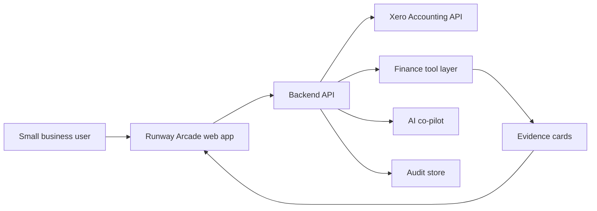

# Runway Arcade

An evidence-backed, gamified Xero cashflow co-pilot for small businesses.

## Description

Runway Arcade helps a small business founder understand cash runway, supplier pressure, overdue invoices and short-term payment choices without switching between spreadsheets, dashboards and accounting tabs.

The project combines a finance cockpit with a playable Cash Quest layer. Customers, suppliers and costs become interactive objects in a game-like map, while the Xero Co-Pilot explains the money impact using evidence cards and approval-gated recommendations.

This repository contains the hackathon documentation pack, submission material and static Lovable preview mirrors. It does not currently contain the original editable Lovable source tree.

## Table of Contents

- [Features](#features)
- [Tech Stack](#tech-stack)
- [Architecture Overview](#architecture-overview)
- [Installation](#installation)
- [Usage](#usage)
- [Configuration](#configuration)
- [Screenshots and Demo](#screenshots-and-demo)
- [API and CLI Reference](#api-and-cli-reference)
- [Tests](#tests)
- [Roadmap](#roadmap)
- [Contributing](#contributing)
- [Licence](#licence)
- [Contact and Support](#contact-and-support)

## Features

- Xero-centred cashflow dashboard for runway, cash position, bills, invoices and near-term finance hazards.
- Cash Quest game mode where the founder walks around an isometric map and interacts with customers, suppliers and costs.
- Evidence cards that show which finance records support each recommendation.
- Xero Co-Pilot designed to answer with tool-backed finance reasoning rather than unsupported guesses.
- Optional persona modes, including Tiger Mum cashflow discipline mode and Top Gun-style command language.
- MAYDAY planning mode for urgent cash squeeze scenarios.
- Approval-gated actions for chase, delay, payment-route and recovery simulations.
- Audit and handover documentation for judges, reviewers and future maintainers.

## Tech Stack

Current checked-in mirror:

- Static Lovable preview bundle.
- Node.js static server in `runway-arcade-local/server.js`.
- Local fallback endpoints for preview rendering.
- Markdown documentation in `docs/` and `materials/`.

Intended production architecture:

- React and TypeScript frontend.
- Server-side API for Xero OAuth, data normalisation, finance tools, AI orchestration and audit.
- Xero Accounting API for invoices, bills, contacts, payments, bank accounts and reports.
- AI co-pilot using deterministic finance tools and evidence rendering.
- Persistent database for organisations, approvals, audit events and token metadata.

## Architecture Overview



The dashboard and Cash Quest UI should read from the same normalised finance data as the co-pilot tools. The AI layer should not invent figures; it should call bounded finance tools, return evidence, and require explicit approval before any external action or future Xero write.

See [ARCHITECTURE.md](ARCHITECTURE.md) and [docs/04-system-architecture-and-diagrams.md](docs/04-system-architecture-and-diagrams.md) for more detail.

## Installation

Clone the repository:

```sh
git clone git@github.com:MasteraSnackin/runway-arcade.git
cd runway-arcade
```

Run the local Runway Arcade mirror:

```sh
cd runway-arcade-local
npm start
```

Open:

```text
http://localhost:4173/
```

Run the Blockhaven reference mirror on a separate port:

```sh
cd blockhaven-local
PORT=4174 npm start
```

Open:

```text
http://localhost:4174/
```

## Usage

Use the Lovable-hosted demo for the current interactive prototype:

[Runway Arcade public demo](https://b7e2658e-9692-47eb-90a9-01b85ad30d73.lovableproject.com/)

Use the local mirror for review, documentation and rebuild planning:

```sh
cd runway-arcade-local
npm start
```

The local mirror is useful for previewing the deployed bundle, but product changes should be made in the editable Lovable project or a rebuilt source application.

## Configuration

The checked-in static mirror does not require environment variables.

Production configuration should use server-side secrets only:

| Variable | Purpose | Notes |
| --- | --- | --- |
| `XERO_CLIENT_ID` | Xero OAuth application client ID. | Server-side only. |
| `XERO_CLIENT_SECRET` | Xero OAuth application secret. | Never expose to the browser. |
| `XERO_REDIRECT_URI` | OAuth redirect URL. | Must match the Xero developer portal. |
| `DATABASE_URL` | Persistent store for tenants, audit and approvals. | Required for production. |
| `AI_PROVIDER_API_KEY` | AI runtime key, if not using a managed gateway. | Server-side only. |

The MVP should use least-privilege Xero read scopes. Write scopes should remain disabled until role checks, explicit confirmation, audit logging and payload previews are implemented.

## Screenshots and Demo

### Dashboard Overview


### MAYDAY / Judge Demo State


## API and CLI Reference

Local commands:

```sh
cd runway-arcade-local
npm start
npm run sync -- https://lovable.dev/preview/preview-id
```

Production API contracts are documented in [docs/13-api-contract.md](docs/13-api-contract.md). Planned backend surfaces include:

- `GET /api/v1/dashboard`
- `POST /api/v1/copilot/respond`
- `POST /api/v1/tools/run`
- `GET /api/v1/proposed-actions`
- `POST /api/v1/proposed-actions/:id/approve-simulation`

## Tests

No automated test suite is currently checked into this repository.

Recommended production tests:

- Unit tests for cash, runway, forecast, overdue invoice and bill calculations.
- Contract tests for the Xero adapter.
- UI tests for approval gates, MAYDAY mode and Cash Quest interactions.
- Regression tests to prove dashboard numbers and co-pilot evidence use the same finance helpers.

## Roadmap

- Recover or export the editable Lovable source.
- Rebuild the prototype as a clean React and TypeScript application.
- Add server-side Xero OAuth and read-only Xero data sync.
- Replace demo fixtures with a live Xero adapter while preserving demo fallback mode.
- Add persistent audit logging and approval history.
- Add deterministic finance calculation tests.
- Keep production writes disabled until security, role, consent and audit controls are complete.

## Contributing

This is a hackathon project repository. Before making changes, check whether you are editing:

- documentation and submission material,
- static preview mirrors, or
- future rebuilt source code.

Avoid editing minified deployed bundle assets directly unless it is a temporary demo patch.

## Licence

<ADD LICENCE>

## Contact and Support

Use GitHub issues for repository feedback.

Maintainer contact: <ADD CONTACT>
