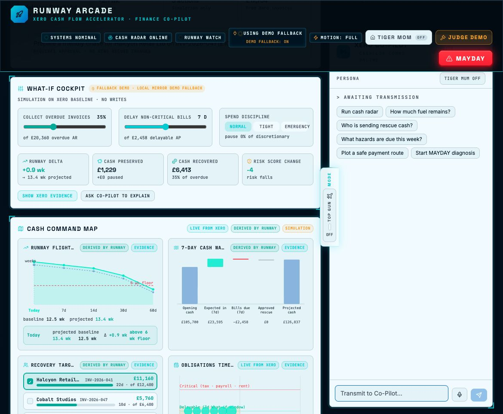
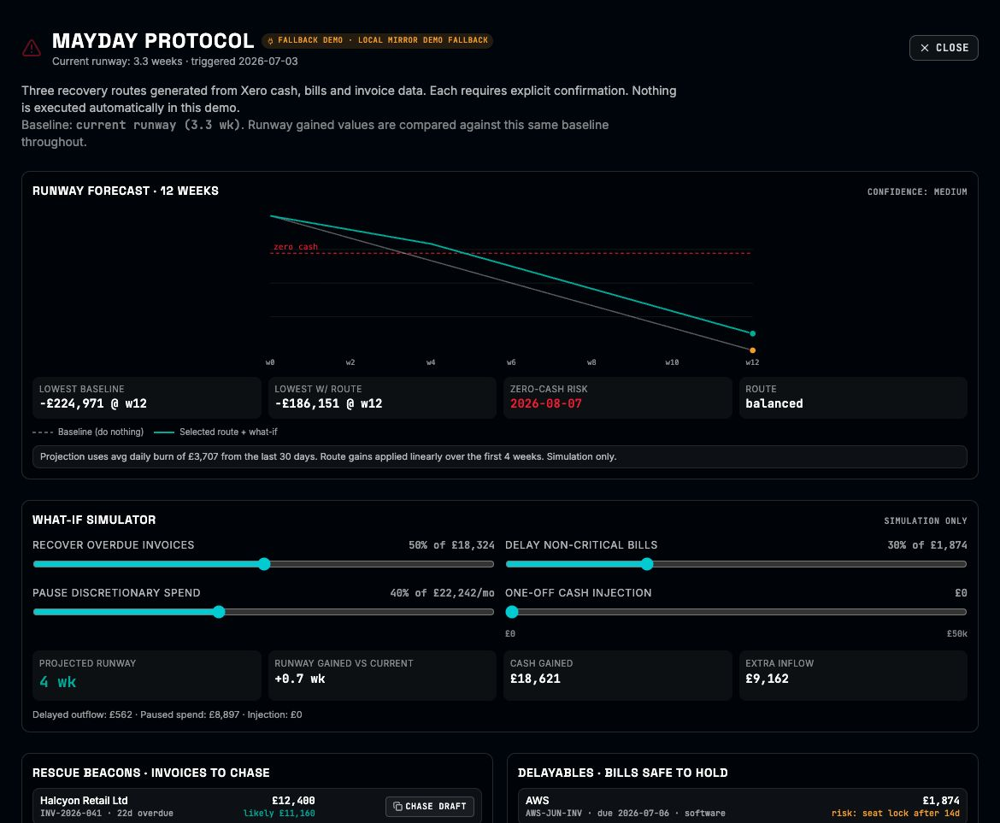

# Xero Hackathon - Runway Arcade

Runway Arcade is a local hackathon workspace for a Lovable-built Xero finance co-pilot demo.

The current local app is a deployed preview mirror rather than the original editable source. It is useful for demo review, documentation, and rebuild planning. The editable Lovable/Git source was not exposed by the preview links inspected in this chat.

## Current Preview

- Current Lovable preview: `https://lovable.dev/preview/9PwGxwRjJf0sZ7tbEsUsruPWSBJYRozm`
- Local mirror: `runway-arcade-local/`
- Local URL: `http://localhost:4173/`
- Current deployed revision: `a1bbe10e2a867d78dfaa7354152e0abd5a8b8221`
- Last synced locally: `2026-07-04T17:17:25Z`

## Screenshots

### Dashboard Overview



### MAYDAY / Judge Demo State



## Workspace Contents

| Path | Purpose |
| --- | --- |
| `runway-arcade-local/` | Static local mirror of the current Lovable deployed bundle. |
| `docs/` | Product, technical, API, calculation, security, QA, rebuild and user documentation. |
| `materials/` | Project collateral for hackathon submission, judging, pitch, handover and launch copy. |

## Persona Modes

The latest mirrored app includes optional persona/mode controls:

- `Tiger Mum` / `Tiger Mom` cashflow discipline mode.
- `Top Gun` mode controls in the command bar and desktop side rail.
- A co-pilot persona row inside the Xero Co-Pilot panel.

The Tiger Mum persona is documented in `materials/tiger-mum-cashflow-persona.md`. Implementation-ready persona configs are in `materials/persona-configs/`.

The local `runway-arcade-local/` app is still a mirrored deployed bundle, so source-level changes should happen in the recovered Lovable/Git source or a rebuilt source app, not the minified deployed JavaScript.

## Run The Local App

```sh
cd runway-arcade-local
npm start
```

Open:

```text
http://localhost:4173/
```

## Sync A Lovable Preview

```sh
cd runway-arcade-local
npm run sync -- https://lovable.dev/preview/preview-id
```

The sync script follows the Lovable preview redirect, downloads the current deployed assets, removes Lovable preview-only badge/telemetry snippets, and records provenance in `runway-arcade-local/mirror-info.json`.

## Known Limitation

This workspace does not contain the original editable Lovable source. To continue development, either obtain the original source from Lovable/Git or rebuild the application using the specifications in `docs/` and the collateral in `materials/`.
