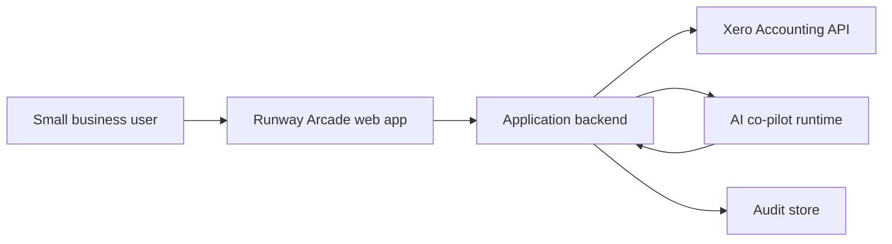
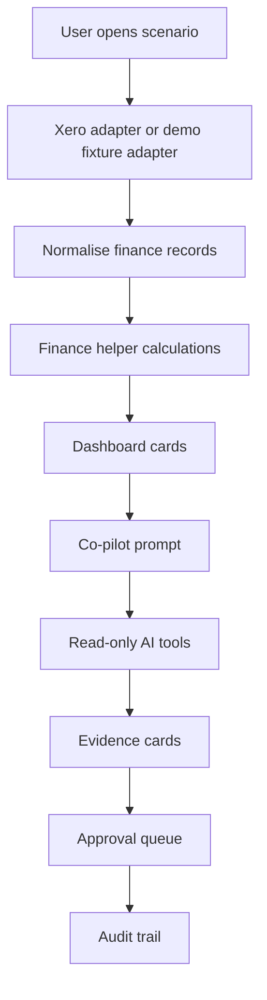
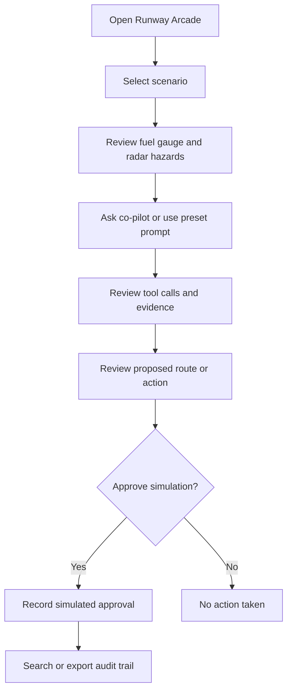
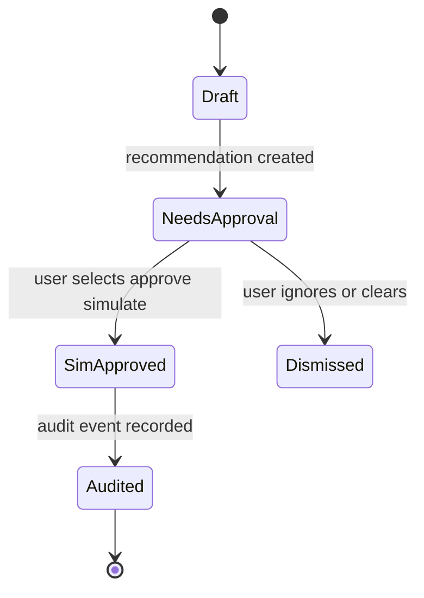
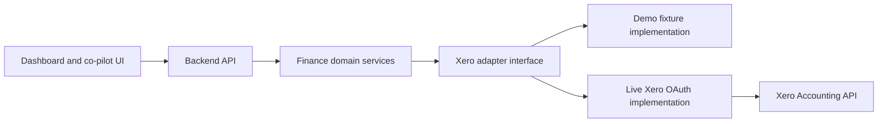
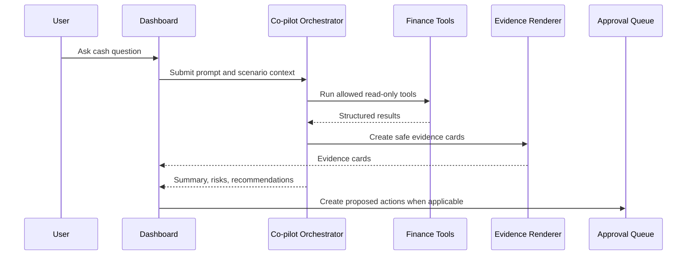

# Architecture and Diagrams

These diagrams describe the MVP inferred from the preview and a recommended production shape. Standalone Mermaid files are also available in `docs/diagrams/`.

## System Context

## MVP Data Flow

## User Flow

## Approval State Machine

## Production Xero Adapter Boundary

## Co-Pilot Tool Sequence

